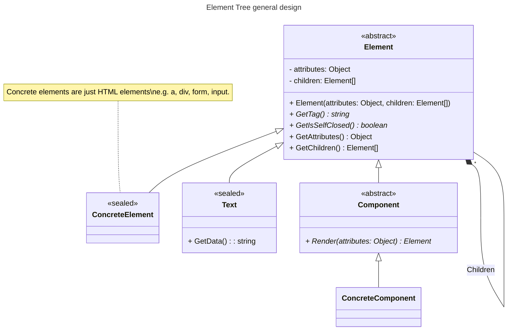

This article focuses on providing a few guidelines to use your current web-app language instead of a templates one to produce HTML.

The main target for this article is **server side HTML output**, but, with some extensions, it could be applied to client side.

## But, why?

Mostly because I'd like to demonstrate you don't need another language to do it as long as you're disciplined enough.

But also because it can save some dev effort for these two reasons:

* You, as a developer, can take advantage of your, in general, deeper knowledge of the dynamics and constructs of the language to build and compose the page, instead of having to learn the syntax, artifacts and philosophy of a templating language.
* It looks cheaper than compiling a language during runtime, also reducing the number and complexity of the project's dependencies.

Also, I have the **perceived** idea that, with the raise if SPAs, a full blown template engine could be an overkill for the needed task, which is just produce the initial HTML.

## The principles of your language as HTML producer

In order to define the patterns and guidelines of a library which purpose is to output HTML, we need to strive for certain principles which are.

1. One-way, no look back.
2. Mimic markup structure as much as possible.
3. Artifact consistency.

### One way, no look back

The idea here is that you will never hold any reference to any of the elements of the page. You can only create and add them to the tree.

Once created, there's no way to modify it.

### Mimic markup structure as much as possible

This principle aims to try to make the code that creates the elements look like an HTML document. That is, to look like nodes that have attributes and children nodes. This one requires from API designer's creativity and good usage of the language tools. It becomes a bit easier to do when you follow the previous principle.

### Artifact Consistency

The concept in this case is simple: Everything you create in a document is either an element or something that produces an element. And all of them can be built by the exact same mechanism.

Yet, simple as it is, the temptation to violate it is big, so, it is always good to have it into account.

## The general strategy

Our hypothetical library should be able to produce the HTML with just two steps:

1. Build an Elements tree.
2. Produce HTML from that tree.

For our current scenario, we're assuming that the library is for the server side, thus, we only need to produce the HTML once and serve it, no need to be able to modify it.

## The Elements tree

The first thing we want to do is build the elements tree. Such object will be a lightweight representation of the entire page. It must fulfill these characteristics:

* It must be read-only (one-way principle). This includes the fact that Nodes should not hold a reference to their parent.
* It must hold only enough information to produce the HTML document.
* It must be easy to build.
* It must be composed of a combination of these three types of node: Elements, Components or Text. (Mimic markup structure and Artifact Consistency).

Here's a basic class diagram depicting the Elements tree structure.

### The Text special element

### The standard elements suite (Concrete Elements)

### Components

## HTML renderer

## Some renderer goodies

### The dataset special attribute

### The boolean attributes

### The attribute value factories

#### Class names

#### Style builder