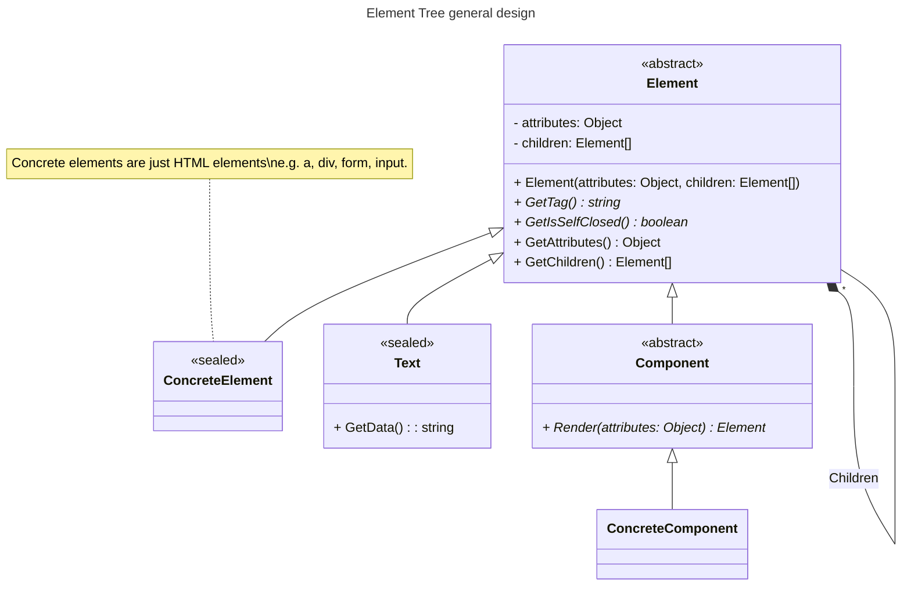
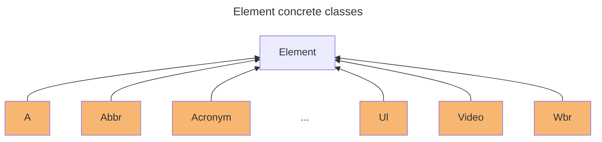

This article focuses on providing a few guidelines to use your current web-app language instead of a templates one to produce HTML.

The main target for this article is **server side HTML output**, but, with some extensions, it could be applied to client side.

> **Note:** In this article we won't implement the solution, but rather provide some theoretical guidelines on how to do so, you can look at some example implementations at the [Conclusions and Sample implementations](#conclusions-and-sample-implementations) section.

## But, why?

Mostly because I'd like to demonstrate you don't need another language to do it as long as you're disciplined enough.

But also because it can save some dev effort for these two reasons:

* You, as a developer, can take advantage of your, in general, deeper knowledge of the dynamics and constructs of the language to build and compose the page, instead of having to learn the syntax, artifacts and philosophy of a templating language.
* It looks cheaper than compiling a language during runtime, also reducing the number and complexity of the project's dependencies.

Also, I have the **perceived** idea that, with the raise if SPAs, a full blown template engine could be an overkill for the needed task, which is just produce the initial HTML.

## The principles of your language as HTML producer

In order to define the patterns and guidelines of a library which purpose is to output HTML, we need to strive for certain principles which are.

1. One-way, no look back.
2. Mimic markup structure as much as possible.
3. Artifact consistency.

### One way, no look back

The idea here is that you will never hold any reference to any of the elements of the page. You can only create and add them to the tree.

Once created, there's no way to modify it.

### Mimic markup structure as much as possible

This principle aims to try to make the code that creates the elements look like an HTML document. That is, to look like nodes that have attributes and children nodes. This one requires from API designer's creativity and good usage of the language tools. It becomes a bit easier to do when you follow the previous principle.

### Artifact Consistency

The concept in this case is simple: Everything you create in a document is either an element or something that produces an element. And all of them can be built by the exact same mechanism.

Yet, simple as it is, the temptation to violate it is big, so, it is always good to have it into account.

## The general strategy

Our hypothetical library should be able to produce the HTML with just two steps:

1. Build an Elements tree.
2. Produce HTML from that tree.

For our current scenario, we're assuming that the library is for the server side, thus, we only need to produce the HTML once and serve it, no need to be able to modify it.

## The Elements tree

The first thing we want to do is build the elements tree. Such object will be a lightweight representation of the entire page. It must fulfill these characteristics:

* It must be read-only (one-way principle). This includes the fact that Nodes should not hold a reference to their parent.
* It must hold only enough information to produce the HTML document.
* It must be easy to build.
* It must be composed of a combination of these three types of node: Elements, Components or Text. (Mimic markup structure and Artifact Consistency).

Here's a basic class diagram depicting the Elements tree structure.



As you can see, the main piece is the `Element` abstract class. This one represents the entirety of the tree nodes and contains all the necessary info to produce the HTML, let's see its properties:

- Tag: The element's tag name, this must comply with the HTML's standard, the library MUST validate it to avoid cross-site scripting (XSS) attacks from third party libraries.
- Attributes: This object contains all the element's attributes (those that come after the tag e.g. `<a attribute1="" someOtherAttribute>`). The idea is that the library can accept any object in this property, that way, any current and future HTML attribute will be supported.
- IsSelfClosed: This property indicates that this element has no children, thus, should look something like this: `<br />` or `<input type="text" />`.
- Children: Are all the child elements, this is what makes the `Element` class represent a tree.

There's a few things to notice about the class:

1. All of its properties are read-only. This is to enforce the "One-way, no look back" principle, encouraging the library user to avoid dealing with state while building the tree.
2. You cannot traverse back from children to parent, this is to help simplify HTML producer (a.k.a. renderer) design, and to keep library user from doing clever things with the tree.

The target of the above constraints is to enforce the notion of the library as *just an HTML producer*, any complex logic should be dealt with before using it.

All other in the diagram are just implementations of `Element`, those represent the tree types of node our library should recognize: Concrete elements (`<a>`, `<div>`, `<input>`, etc.), Text and Components.

Let's see each type of node next.

### The standard elements suite (Concrete Elements)

Concrete elements are expected to be read-only, non-inheritable and direct implementations of `Element`. The idea is that you create a series of `Element` sub-classes which sole purpose is to represent one specific element. 



These would become the basic building blocks of the page (alongside with the Text Element which we'll see next). Creating new elements should always be as simple as inheriting from `Element` and implementing its abstract methods.

Just remember a few rules:

1. They must be sealed and read-only.
2. They must not do anything except hold the info necessary to produce an HTML element, that is, the tag, the attributes, is it self-closed, and the children (if not self-closed).

Any extra capability we would like to see on an element will be handled by other objects in the library, e.g. the view logic (which is different from the business logic) will be handled by the Components, and any validation should be handled by the HTML producing system.

The library should include the full set of HTML elements, this is not mandatory, but could be appreciated by its users. 

Creating non-supported elements, e.g. elements introduced by new HTML standards or [HTML web components](https://developer.mozilla.org/en-US/docs/Web/Web_Components) should be pretty simple since all you need is to extend the `Element` class.

The usage of these elements should be pretty straight-forward, and it is up to the library author's creativity to provide ways to make it as comfortable as possible for the user.

Some possible examples:

JavaScript

```javascript
a({ href: "#" })(
  span()("Some Text")
);

// Or
a({ href: "#" },
  span(null, "Some Text")
);

// Or
A.href("#")(
  span("Some Text")
);

// Or whatever mechanism you can come up with.
```

C#

```csharp
// Assuming you're withing a method:

_<A>(new Attrs{ Href="#" }, 
  _<Span>("Some Text")
);

// Or
new A(new Attrs{ Href="#" }, 
  new Span(null, "Some Text")
);

// Or
new A(attrs => {
    attrs.Href = "#"
  },
  new Span("Some Text")
);
```

There are many ways to approach elements instantiation, the important thing is that it should aim to these two items:

1. Be consistent, the ways to instantiate an element should be pretty limited, 1 if possible.
2. It must try to mimic HTML look as much as possible, e.g. by using Generics as in C#, or currying as in JavaScript.

Now, let's see the next important part of the library, the Text Element.

### The Text special element


### Components

## HTML renderer

## Some renderer goodies

### The dataset special attribute

### The boolean attributes

### The attribute value factories

#### Class names

#### Style builder

## Conclusions and Sample implementations

